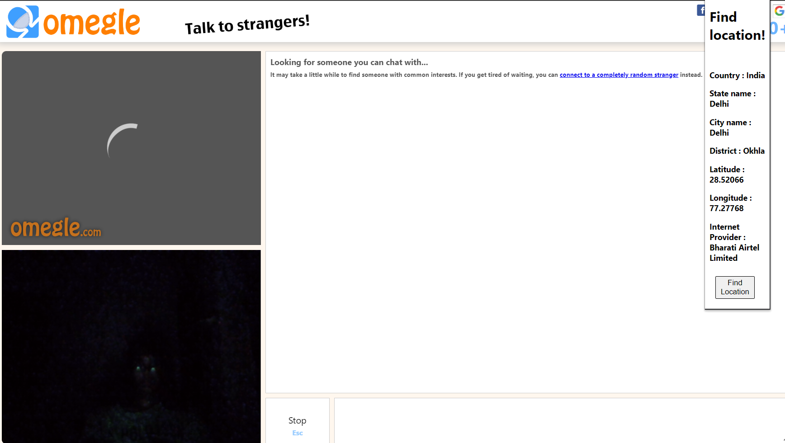

<h3>An chrome extension to track down live location on omegle</h3>

Omegle is a real-time app with random Internet users' websites. When you use Omegle to chat with strangers, there are many ways to track people's IP addresses.
Well, while tracking an IP address on Omegle, your IP can only be tracked to a specific ISP, but not further than that. It also records some data that can be shared with third parties in urgent situations

###### As it is my first time creating an chrome extension, I'll improve and fix some minor bugs while i'm learning and will surely publish it on chrome web store
